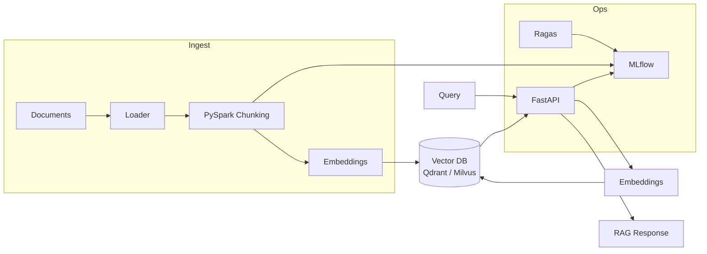

# Architecture

## Overview

The platform is a modular, production-grade RAG system. Documents are ingested and
chunked in a distributed fashion with PySpark, embedded with a local OSS model, and
indexed into a vector database behind a common abstraction. A FastAPI service exposes
ingestion and retrieval endpoints, while Ragas and MLflow cover evaluation and
experiment tracking.

## Module Responsibilities

### `config/`

`Settings` is a `pydantic-settings` model loaded from `RAG_*` environment variables
(see `.env.example`). It centralizes every tunable knob: chunk size/overlap, embedding
model, vector DB endpoints, MLflow URI, and API binding. `get_settings()` is memoized
so the whole process shares one configuration object.

### `ingestion/`

- **`loader.py`** — loads `.txt`, `.md`, and `.pdf` documents into raw text.
- **`chunker.py`** — pure, dependency-light token chunking. A sliding window over
  whitespace tokens guarantees full coverage and overlapping boundaries, which is the
  main lever on retrieval recall/precision.
- **`spark_pipeline.py`** — expands a PySpark DataFrame of documents into chunk rows
  via a picklable UDF, enabling fully distributed chunking of large corpora.
- **`cli.py`** — `rag-ingest` batch command: loads files, chunks, embeds, and upserts
  into the configured vector store.

### `embeddings/`

`EmbeddingProvider` is a small interface (`embed_documents`, `embed_query`,
`dimension`). `SentenceTransformerProvider` lazily loads a local
`sentence-transformers` model (torch is never imported on the serving import path),
normalizes embeddings, and batches encoding.

### `vectorstore/`

`VectorStore` is the abstraction contract: `create_collection`, `upsert`, `search`,
`delete`, `count`. `QdrantStore` and `MilvusStore` implement it. `build_vector_store`
selects the backend from configuration, so the rest of the platform is
backend-agnostic. The dense vector is named `dense` to leave room for a future sparse
vector for hybrid search.

### `api/`

FastAPI application with:

- `POST /v1/ingest` — ingest a document (text + metadata) → chunk → embed → upsert.
- `POST /v1/search` — embed a query and return top-k hits with metadata.
- `GET /health` — liveness probe.

Dependencies (`get_embedder`, `get_vector_store`) are created once and overridable in
tests.

### `evaluation/`

`evaluate_rag` runs Ragas metrics (`faithfulness`, `answer_relevancy`,
`context_precision`, `context_recall`) over a dataset of
`{question, answer, contexts, ground_truth}` samples. Heavy Ragas imports are lazy so
the serving path stays lean.

### `mlflow_tracking/`

`track_run` is a context manager that opens an MLflow run and logs parameters; metrics
and artifacts are logged inside the block. Used to track ingestion pipelines and
evaluation experiments.

## Design Decisions

- **Lazy heavy imports** — torch (via sentence-transformers), Ragas, and MLflow are
  imported only where used, so the API image and import time stay minimal.
- **Backend-agnostic vector store** — the `VectorStore` interface means Qdrant and
  Milvus are drop-in replacements behind a single factory.
- **Deterministic, hermetic tests** — the test suite uses a fake embedding provider and
  Qdrant in-memory mode (`path=":memory:"`), so tests run without a running DB or
  network access.
- **Overlapping token chunks** — overlap mitigates context loss at chunk boundaries,
  improving retrieval quality for downstream RAG.
