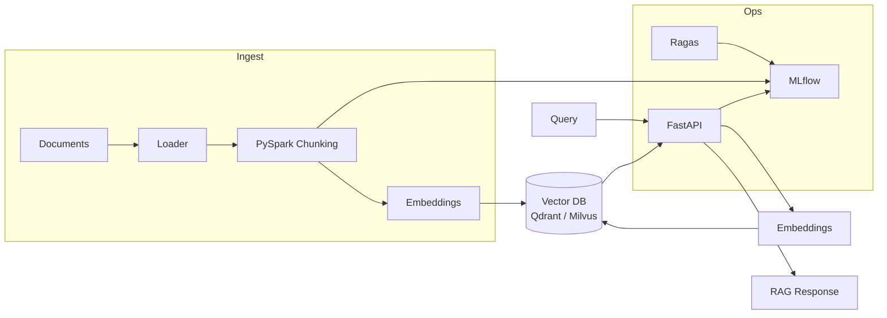

# Architecture

## Overview

The platform is a modular, production-grade RAG system. Documents are ingested and
chunked in a distributed fashion with PySpark, embedded with a local OSS model, and
indexed into a vector database behind a common abstraction. A FastAPI service exposes
ingestion and retrieval endpoints (dense, hybrid dense+sparse, and cross-encoder
reranking), while Ragas and MLflow cover evaluation and experiment tracking.

## Module Responsibilities

### `config/`

`Settings` is a `pydantic-settings` model loaded from `RAG_*` environment variables
(see `.env.example`). It centralizes every tunable knob: chunk size/overlap, embedding
model, vector DB endpoints, MLflow URI, and API binding. `get_settings()` is memoized
so the whole process shares one configuration object.

### `ingestion/`

- **`loader.py`** — loads `.txt`, `.md`, and `.pdf` documents into raw text.
- **`chunker.py`** — pure, dependency-light chunking with two modes: ``window``
  (sliding token window, full coverage and overlap) and ``semantic``
  (structure-aware: keeps markdown sections together, splitting oversized ones
  with the token window). The mode is selected by ``RAG_CHUNK_MODE``.
- **`spark_pipeline.py`** — expands a PySpark DataFrame of documents into chunk rows
  via a picklable UDF (honoring the chunking mode), enabling fully distributed
  chunking of large corpora.
- **`streaming.py`** — Spark Structured Streaming ingestion: the `binaryFile`
  source emits every new file in a watched directory as a micro-batch, chunks are
  produced with the same distributed UDF, and `foreachBatch` embeds + upserts them
  to the vector store from the driver. Checkpoints make restarts idempotent.
- **`cli.py`** — `rag-ingest` command: loads files, chunks, embeds, and upserts
  into the configured vector store. `--distributed` chunks through
  `spark_pipeline.py` (a local PySpark session) instead of single-process
  tokenization, and `--stream --watch <dir> --checkpoint <dir>` runs the
  continuous streaming pipeline.

### `embeddings/`

`EmbeddingProvider` is a small interface (`embed_documents`, `embed_query`,
`dimension`). `SentenceTransformerProvider` lazily loads a local
`sentence-transformers` model (torch is never imported on the serving import path),
normalizes embeddings, and batches encoding.

`HashingSparseEncoder` produces deterministic, L2-normalized sparse vectors via
feature hashing (sklearn). Queries and documents share the same vectorizer, so the
index space stays aligned for hybrid retrieval; it can be swapped for a SPLADE model
without changing call sites.

### `vectorstore/`

`VectorStore` is the abstraction contract: `create_collection`, `upsert`, `search`,
`delete`, `count`. `QdrantStore` and `MilvusStore` implement it. `build_vector_store`
selects the backend from configuration, so the rest of the platform is
backend-agnostic.

Points carry a named dense vector (`dense`) and, for hybrid backends, an optional
sparse vector (`sparse`). `supports_hybrid` gates `search_hybrid`, which Qdrant
implements with native reciprocal rank fusion (prefetch of both vectors +
`FusionQuery(RRF)`); Milvus stores the sparse representation in a
`SPARSE_FLOAT_VECTOR` field and fuses dense + sparse with its own `RRFRanker`
(shared helper `sparse_to_milvus` converts the hashed `SparseVector` into
Milvus' `{index: value}` dicts). `iter_points` scrolls the whole collection for
offline jobs (drift monitoring). A pure, tunable client-side RRF
(`vectorstore/fusion.py`) plus a sparse-only search (`search_sparse`) are also
available, since the Qdrant server exposes no knob for the RRF constant — used by
the fusion sweep.

### `reranking/`

`CrossEncoderReranker` scores `(query, candidate)` pairs with a
`sentence-transformers` cross-encoder, and `rerank_hits` reorders a retrieved list
while stamping the cross-encoder score. Endpoints fetch `rerank_top_k` candidates and
trim to `top_k` when `rerank` is enabled.

### `generation/`

`OllamaClient` builds a strict "answer only from context" prompt and calls a local
Ollama model, returning the grounded answer together with its retrieved sources.
It also provides `generate_hypothesis` for HyDE query expansion, and `hyde.py`
embeds the hypothetical passage for retrieval.

### `api/`

FastAPI application with:

- `POST /v1/ingest` — ingest a document (text + metadata) → chunk → embed → upsert.
- `POST /v1/search` — embed a query and return top-k hits with metadata.
- `POST /v1/rag` — retrieve context and generate a grounded answer with Ollama.
- `GET /health` — liveness probe.

Requests accept `hybrid` (dense+sparse RRF), `rerank` (cross-encoder) with an
optional per-request `rerank_top_k` pool, and `hyde` (LLM-generated hypothetical
query embedding) flags. Dependencies (`get_embedder`, `get_vector_store`,
`get_sparse_encoder`, `get_reranker`) are singletons, created once per process and
overridable in tests.

Multi-tenancy is enforced at the API layer: `tenant_id` is stamped on every chunk
at ingestion and injected into the retrieval filters by `scope_filters`
(`api/tenancy.py`), so search and generation are always scoped to one tenant on a
shared collection. Qdrant indexes the `tenant_id` payload field for fast scoped
lookups.

Security and observability are layered on in `main.py`: an opt-in `X-API-Key`
dependency (`RAG_API_KEY`) guards `/v1/*`, a per-client sliding-window rate
limiter caps traffic (`RAG_RATE_LIMIT_PER_MINUTE`), and a request middleware logs
latency and feeds a dependency-free Prometheus-style collector
(`observability/metrics.py`) exposed at `GET /metrics`.

### `evaluation/`

`evaluate_rag` runs Ragas metrics (`faithfulness`, `answer_relevancy`,
`context_precision`, `context_recall`) over a dataset of
`{question, answer, contexts, ground_truth}` samples. Heavy Ragas imports are lazy so
the serving path stays lean. `run_evaluation` is an end-to-end runner: it queries
`/v1/rag` for every question, persists the collected samples, scores them with a
self-hosted LLM (Ollama) and optionally logs the run to MLflow. `--hybrid`/`--rerank`
switch the retrieval mode (dense by default), which is recorded as the `retrieval`
run parameter so retrieval variants can be compared (A/B) in MLflow.

`retrieval_metrics.py` provides pure, deterministic chunk-level metrics (`MRR@k`,
`hit-rate@k`, `nDCG@k`) over ranked lists of `(source, chunk_index)` keys, and
`run_retrieval_eval` scores the `/v1/search` ranking for a labelled query set,
allowing the retrieval stage to be tuned independently of the generator. Relevance
is resolved from per-document keywords against the current chunking config, so the
same dataset stays valid across chunk-size ablations. `run_ablation` re-ingests
the corpus over a `chunk_size` × `chunk_overlap` grid and logs each configuration
to MLflow; `run_rrf_sweep` fuses the dense and sparse rankings client-side with a
tunable RRF constant and sweeps it.

### `mlflow_tracking/`

`track_run` is a context manager that opens an MLflow run and logs parameters; metrics
and artifacts are logged inside the block. Used to track ingestion pipelines and
evaluation experiments.

## Design Decisions

- **Lazy heavy imports** — torch (via sentence-transformers), Ragas, and MLflow are
  imported only where used, so the API image and import time stay minimal.
- **Backend-agnostic vector store** — the `VectorStore` interface means Qdrant and
  Milvus are drop-in replacements behind a single factory.
- **Deterministic, hermetic tests** — the test suite uses a fake embedding provider and
  Qdrant in-memory mode (`path=":memory:"`), so tests run without a running DB or
  network access.
- **Overlapping token chunks** — overlap mitigates context loss at chunk boundaries,
  improving retrieval quality for downstream RAG.
- **Native hybrid fusion (RRF)** — Qdrant's prefetch + `FusionQuery(RRF)` merges dense
  and sparse rankings server-side, with no client-side score arithmetic.
- **Hashing sparse encoder** — dependency-free, deterministic sparse vectors; a SPLADE
  model can replace it behind the same interface.
- **Reranking as an opt-in flag** — a wider candidate set is re-scored by a
  cross-encoder only when requested, keeping default latency minimal.
- **Measurable retrieval A/B** — the evaluation runner can target dense or
  hybrid+rerank retrieval; on the sample corpus this showed `context_recall`
  improving from 0.83 to 0.97, a quantitative proof of the retrieval stack.
- **Chunking is measured, not assumed** — chunk size/overlap are ablated
  empirically, and structure-aware chunking was implemented and measured before
  adoption: on the sample corpus it ranked below the token-window optimum, so it
  stays an opt-in mode rather than the default.
- **Retrieval tuning is measured, not assumed** — the rerank candidate pool and
  HyDE query expansion were implemented and swept/measured: the default pool of
  10 was confirmed optimal, and HyDE did not beat dense retrieval on the small
  corpus, so both remain opt-in rather than defaults.
- **Dependency-free security and observability** — API-key auth, rate limiting
  and a Prometheus-style metrics endpoint are implemented with the standard
  library (no extra deps), keeping the serving image lean while still exposing
  the production surfaces an operator expects.
- **Threshold-based drift monitoring** — the corpus is snapshotted as an
  embedding centroid plus count and source metadata, and compared against a
  stored baseline. Thresholds avoid false alarms on healthy growth (a single
  added document stays below them), and the whole collection is read through a
  backend-agnostic `iter_points`, so drift works against any store.
- **Reproducible, CVE-hardened images** — the serving base image is pinned to a
  digest, so upstream changes cannot silently pull new CVEs into the image;
  updating the base is an explicit, reviewed change.
- **Continuous ingestion via structured streaming** — a watched directory is
  turned into a fault-tolerant stream with Spark Structured Streaming; `foreachBatch`
  reuses the exact batch embed+upsert path, so streaming and batch produce
  identical payloads and there is no second ingestion code path to maintain.
- **Multi-tenancy at the retrieval layer** — chunks are tagged with `tenant_id` and
  every request is scoped to one tenant via an injected payload filter; isolation
  lives in the query path (shared collection) rather than duplicating collections
  per tenant, and the `tenant_id` field is indexed for filtered scans.
- **Hybrid on every backend** — the sparse representation and `search_hybrid`
  contract are implemented on both Qdrant (native RRF) and Milvus
  (`SPARSE_FLOAT_VECTOR` + `RRFRanker`), so the abstraction never leaks backend
  capability differences into the retrieval code.
